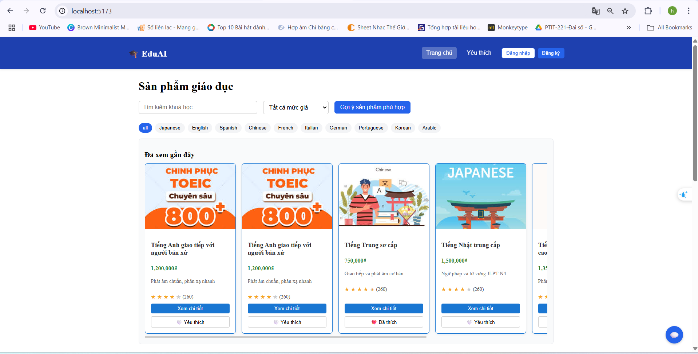
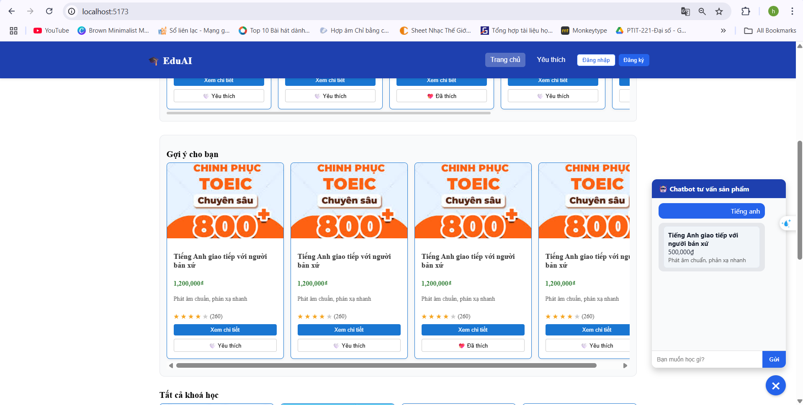
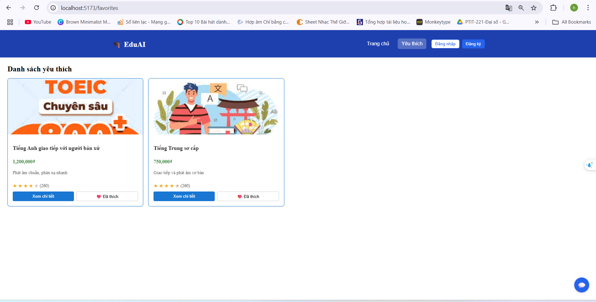

# 🧠 EduAI – Nền tảng thương mại giáo dục sử dụng AI

> EduAI là một nền tảng bán khóa học trực tuyến, hỗ trợ tìm kiếm, gợi ý và tư vấn bằng AI. Giao diện đẹp, dễ dùng, tích hợp chatbot hỗ trợ người học tìm đúng sản phẩm phù hợp.

## 🚀 Tính năng nổi bật

- Tìm kiếm khóa học theo từ khóa, bộ lọc giá, ngôn ngữ
- Gợi ý sản phẩm dựa trên nhu cầu nhập vào
- Chatbot tư vấn sản phẩm đơn giản (mock AI)
- Đăng ký, đăng nhập, yêu thích sản phẩm
- Hiển thị sản phẩm đã xem gần đây

## 🧩 Công nghệ sử dụng

- ⚛️ React + TypeScript
- 💬 Chatbot UI tùy chỉnh
- 📦 Fake API với dữ liệu mock

## 🧪 Hướng dẫn cài đặt & chạy local

### 1. Clone dự án

```bash
git clone https://github.com/hungpptit/ecom-edu-ai.git
cd ecom-edu-ai
```  

### 2. Cài đặt dependencies

```bash
npm install
# hoặc nếu bạn dùng yarn:
# yarn install
```

### 3. Chạy dự án ở môi trường phát triển
```bash
npm run dev
# hoặc
# yarn dev
```
## 📌 Ghi chú

- 🤖 **Chatbot AI** hoạt động đơn giản dựa trên từ khóa và danh sách sản phẩm mẫu.
- 🗂️ **Dữ liệu sản phẩm** hiện đang được mock sẵn tại: `/src/data/products.ts`.
- 💾 **Trạng thái ứng dụng** (danh sách yêu thích, lịch sử chat) được lưu hoàn toàn ở client qua

  ## 📷 Giao diện demo

 
📚 Hiển thị danh sách khóa học: Người dùng có thể xem tất cả các sản phẩm giáo dục dưới dạng thẻ, bao gồm tên khóa học, giá, mô tả ngắn, đánh giá và nút "Xem chi tiết".

🧠 Gợi ý sản phẩm phù hợp: Có thể lọc theo ngôn ngữ (English, Japanese, Chinese...) và theo mức giá.

🔍 Tìm kiếm theo từ khóa: Khung tìm kiếm hỗ trợ nhập từ khóa tên khóa học để lọc nội dung.

❤️ Lưu khóa học yêu thích: Bấm "Yêu thích" để lưu khóa học vào danh sách yêu thích. Danh sách này được lưu ở LocalStorage và hiển thị tại trang "Yêu thích".

🔍 Lọc theo ngôn ngữ: English, Japanese, French, v.v.

🔎 Tìm kiếm khóa học theo tên hoặc đề xuất phù hợp.

🔎 Tìm kiếm khóa học phù hợp: Người dùng có thể gõ nội dung mong muốn vào khung chatbot tư vấn sản phẩm (góc dưới bên phải). Dựa trên từ khóa nhập vào, chatbot sẽ gợi ý khóa học tương ứng.

🤖 Chatbot thông minh đơn giản: Chatbot hoạt động theo cơ chế keyword matching, phản hồi theo danh sách sản phẩm được mock sẵn.

🧾 Hiển thị sản phẩm dạng thẻ trong chat: Khi tìm thấy khóa học, bot sẽ hiển thị sản phẩm với tên, giá, mô tả thu gọn ngay trong khung chat.

❤️ Yêu thích sản phẩm: Người dùng có thể bấm thích hoặc bỏ thích ngay trên từng thẻ sản phẩm ngoài trang chính.

💖 Hiển thị các khóa học người dùng đã "Yêu thích".

🔁 Có thể xem chi tiết hoặc gỡ khỏi danh sách.


